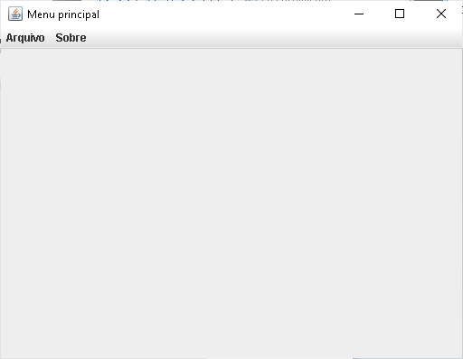
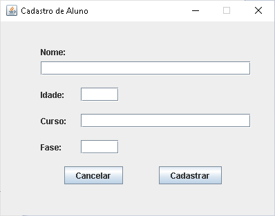
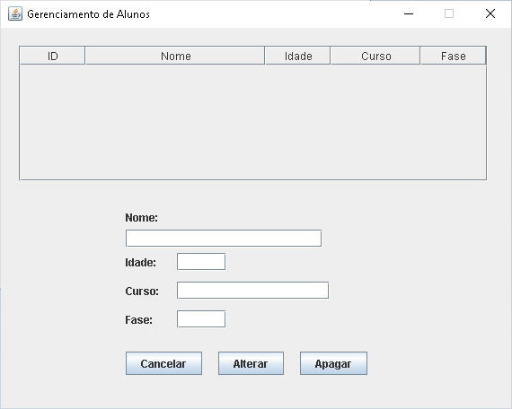

# Interface Gráfica para Controle de Estoque usando um DAO com MySQL usando a IDE NetBeans.

## Contextualização

 - Esta é uma versão do sistema para a IDE NetBeans.<br> 
 - O projeto no NetBeans é chamado ControleEstoqueMySQLDAO.<br>
 - Os dados estão armazenados no banco de dados MySQL.<br>
 - Este programa possui diversas classes organizada nos pacotes, principal, visao, dao e modelo.<br>
 - A pasta src contêm os fontes do projeto.<br>
 - A interface gráfica foi construída **com** o auxílio da IDE NetBeans.<br>

### Banco de dados

- Abaixo o script para a criação do banco de dados e da tabela. O script completo está no arquivo [controledbestoque.sql](controledbestoque.sql).

```
create database if not exists controle_estoque;
use controle_estoque;

create table categorias (
    id INT AUTO_INCREMENT PRIMARY KEY,
    nome VARCHAR(50) NOT NULL,
    descricao TEXT,
    data_cadastro TIMESTAMP DEFAULT CURRENT_TIMESTAMP
);
CREATE TABLE produtos (
    id INT AUTO_INCREMENT PRIMARY KEY,
    nome VARCHAR(100) NOT NULL,
    preco_unitario DECIMAL(10,2) NOT NULL,
    unidade VARCHAR(20) NOT NULL COMMENT 'Ex: un, kg, lt, m, etc',
    quantidade_estoque INT DEFAULT 0,
    quantidade_minima INT DEFAULT 0,
    quantidade_maxima INT DEFAULT 0,
    categoria_id INT,
    data_cadastro TIMESTAMP DEFAULT CURRENT_TIMESTAMP,
    data_atualizacao TIMESTAMP DEFAULT CURRENT_TIMESTAMP ON UPDATE CURRENT_TIMESTAMP,
    FOREIGN KEY (categoria_id) REFERENCES categorias(id));

```

### Interface gráfica

## Tela do menu principal do programa.


## Tela para cadastrar novos alunos.


## Tela para gerenciar alunos (alterar e apagar).


## Arquivos

- banco.sql - Script do banco de dados.
- pom.xml - Arquivo de configuração da ferramenta de automação Maven.
- *.png - Arquivos de imagens do README.md.
